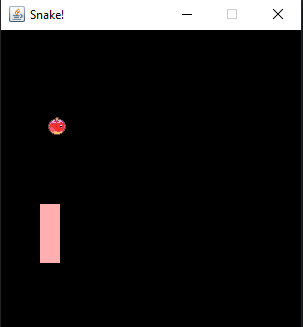

# Snake Game 

A classic Snake game built with Java Swing featuring smooth gameplay, score tracking.

  

## Need to run

-Java JDK 8 or higher

##  How to Play
Control snake by using WASD
Eat apples - grow snake

##  Customization

All the provided customization is available in GameConstants class. 
